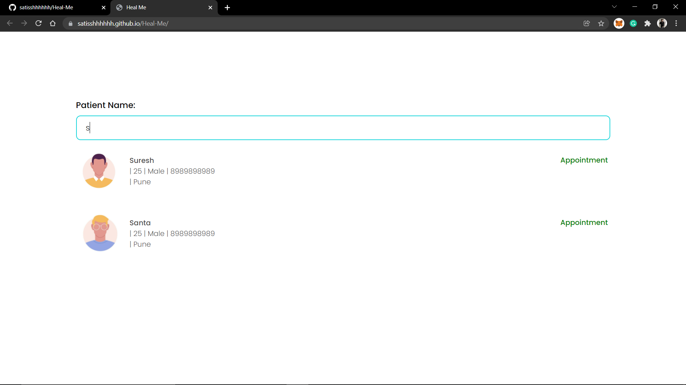
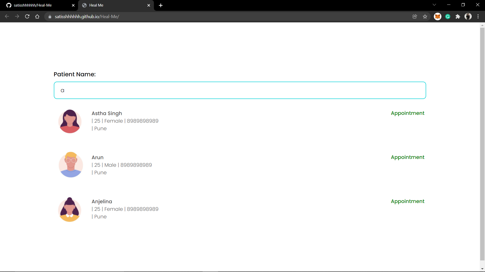
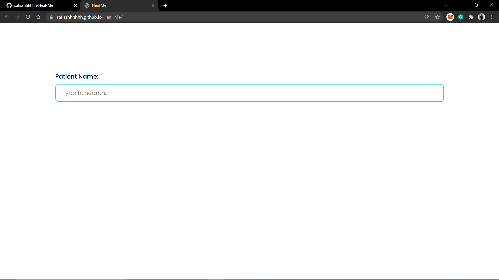

## Heal-ME

This is a small project of Searchable Dropdown Input.
It filters by patients name which are stored in json file
And displays the desired patients data on the screen

If input is empty the dropdown will disappear.

